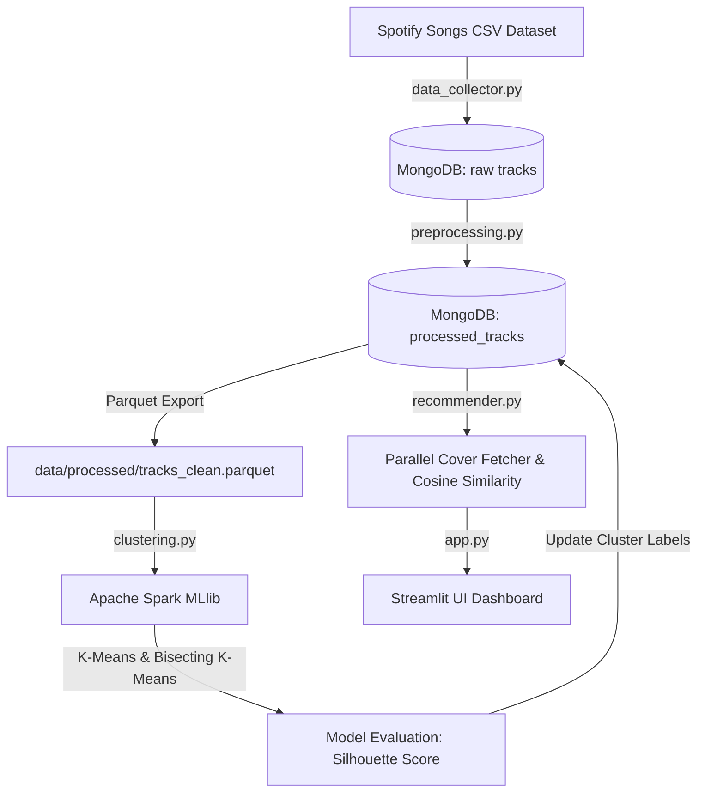

# 🎵 Spotify Audio-Feature Recommender

Hệ thống gợi ý âm nhạc dựa trên đặc trưng âm thanh (Audio Features) tích hợp luồng xử lý dữ liệu lớn (Data Pipeline) toàn diện: **MongoDB**, **Pandas**, **Apache Spark (K-Means)**, **Plotly**, và **Streamlit**.

Hệ thống phân cụm hơn 28,000 bài hát thành các hồ sơ âm thanh khác nhau và đưa ra gợi ý tương thích theo thời gian thực dựa trên độ tương đồng Cosine của các đặc trưng âm học đa chiều.

---

## 🚀 Kiến Trúc Hệ Thống & Luồng Dữ Liệu (Data Flow)



### 1. Thu thập & Làm giàu dữ liệu (`src/data_collector.py`)
* Đọc tập dữ liệu thô gồm 32,833 ca khúc từ tệp CSV.
* Sử dụng thư viện `spotipy` gọi API Spotify để làm giàu (enrich) thông tin bài hát (ảnh album, ca sĩ, link nghe nhạc chính chủ).
* Lưu trữ dữ liệu cấu trúc trực tiếp vào hệ thống cơ sở dữ liệu NoSQL **MongoDB**.

### 2. Tiền xử lý & Chuẩn hóa dữ liệu (`src/preprocessing.py`)
* Loại bỏ trùng lặp và điền khuyết các đặc trưng âm thanh bằng giá trị trung vị của từng thể loại nhạc.
* Chuẩn hóa các cột đặc trưng như `loudness` và `tempo` về khoảng `[0, 1]` bằng MinMax scaling.
* Xây dựng thuộc tính nâng cao: 
  * `energy_valence_ratio = energy / (valence + 0.001)`
  * `mood_score = valence * 0.4 + danceability * 0.3 + energy * 0.3` (Độ tích cực tổng thể).
* Lưu dữ liệu đã làm sạch vào MongoDB (`processed_tracks`) và xuất định dạng cột nén **Parquet** để tối ưu hóa hiệu năng đọc của Apache Spark.

### 3. Huấn luyện & So sánh mô hình trên Apache Spark (`src/clustering.py`)
* Khởi chạy Spark Session ở chế độ phân tán local (`local[*]`).
* Trích xuất vector đặc trưng 10 chiều thông qua Spark MLlib `VectorAssembler`.
* Sử dụng **Phương pháp Elbow** trên tổng sai số bình phương (WSSSE) từ cụm $K=2$ đến $K=10$ để chọn số cụm tối ưu $K=6$.
* **So sánh Mô hình**: Huấn luyện đồng thời cả **Standard K-Means** và **Bisecting K-Means**, đánh giá bằng hệ số Silhouette Score để chọn mô hình tối ưu nhất và cập nhật kết quả phân cụm ngược lại MongoDB.

### 4. Gợi ý thông minh & Tải ảnh song song (`src/recommender.py`)
* Nhận đầu vào là một liên kết (URL) hoặc ID từ Spotify.
* **Cơ chế Phân giải liên kết nâng cao**: 
  * **Link Bài hát (Track)**: Lấy trực tiếp ID bài hát.
  * **Link Ca sĩ (Artist)**: Gọi API lấy thông tin ca sĩ, tìm ca khúc phổ biến nhất của ca sĩ đó làm nhạc hạt giống (seed track).
  * **Link Album**: Gọi API lấy bài hát đầu tiên trong album làm nhạc hạt giống.
  * **Playlist**: Lọc và hiển thị cảnh báo định dạng không hỗ trợ trực quan.
* Gợi ý bài hát tương đồng nhất trong cùng Cluster bằng thuật toán **Cosine Similarity**.
* **Đa luồng song song (ThreadPoolExecutor)**: Tải song song ảnh bìa gốc của các bài gợi ý trực tiếp từ Spotify CDN chỉ trong **~0.4 giây**, khắc phục triệt để vấn đề ảnh tĩnh giả lập.

### 5. Giao diện Dashboard Streamlit (`src/app.py`)
* Giao diện chủ đề tối (Dark Theme) hiện đại, sang trọng theo tiêu chuẩn thiết kế của Spotify.
* Biểu đồ **Radar Chart** (vẽ bằng Plotly) thể hiện trực quan hồ sơ âm học của bài hát đang chọn.
* Thanh Sidebar hỗ trợ lọc động bài hát gợi ý theo Năm phát hành và Độ phổ biến thời gian thực.
* Hỗ trợ phát nhạc và nghe thử trực tiếp thông qua liên kết nghe nhạc Spotify.

---

## 🛠️ Yêu Cầu Hệ Thống & Hướng Dẫn Cài Đặt

### 1. Yêu cầu tiên quyết
Đảm bảo máy tính của bạn đã cài đặt sẵn:
* **Python 3.12+**
* **Java 17+** (Bắt buộc để chạy Apache Spark)
* **MongoDB Server** (Đang chạy ở cổng mặc định `27017`)

*Kiểm tra trạng thái MongoDB:*
```bash
sudo systemctl status mongod
```

### 2. Thiết lập môi trường ảo
Khởi tạo và kích hoạt môi trường ảo để cài đặt đầy đủ các thư viện phụ thuộc:
```bash
# Tạo môi trường ảo
python3 -m venv .venv

# Kích hoạt môi trường ảo (Bắt buộc chạy trước khi thực thi mã nguồn)
source .venv/bin/activate

# Cài đặt các thư viện cần thiết
pip install -r requirements.txt
pip install setuptools
```

### 3. Cấu hình khóa API Spotify
Sao chép tệp `.env.example` thành `.env` và nhập thông tin API của bạn:
```bash
cp .env.example .env
```
Nội dung tệp `.env`:
```env
SPOTIFY_CLIENT_ID=nhập_client_id_của_bạn_ở_đây
SPOTIFY_CLIENT_SECRET=nhập_client_secret_của_bạn_ở_đây
MONGO_URI=mongodb://localhost:27017/
```

---

## 💻 Hướng Dẫn Chạy Luồng Pipeline Dữ Liệu

Để chuẩn bị dữ liệu và mô hình phân cụm cho ứng dụng, hãy chạy lần lượt các lệnh dưới đây (sử dụng trực tiếp trình thông dịch trong `.venv` để tránh lỗi thiếu thư viện của hệ thống):

### Bước 1: Thu thập dữ liệu
Gọi API Spotify để làm giàu dữ liệu và lưu vào MongoDB:
```bash
.venv/bin/python src/data_collector.py
```

### Bước 2: Làm sạch & Tiền xử lý dữ liệu
Chuẩn hóa dữ liệu và xuất tệp Parquet cho Spark:
```bash
.venv/bin/python src/preprocessing.py
```

### Bước 3: Huấn luyện phân cụm với Apache Spark
Chạy Elbow phân cụm và so sánh Standard K-Means với Bisecting K-Means:
```bash
.venv/bin/python src/clustering.py
```

### Bước 4: Khởi chạy Giao diện Dashboard Streamlit
```bash
.venv/bin/streamlit run src/app.py --server.port 8505
```

Mở trình duyệt truy cập địa chỉ: `http://localhost:8505` để kiểm thử sản phẩm!

> [!TIP]
> **Xử lý sự cố nếu báo lỗi cổng bận (Port 8505 is not available):**
> * **Cách 1: Giải phóng cổng 8505**
>   ```bash
>   fuser -k 8505/tcp
>   ```
>   Sau đó chạy lại lệnh Streamlit ở Bước 4.
> * **Cách 2: Chạy trên cổng dự phòng khác (ví dụ: 8506)**
>   ```bash
>   .venv/bin/streamlit run src/app.py --server.port 8506
>   ```

---

## 📊 Kết Quả Phân Tích & So Sánh Mô Hình

* **Phân tích Elbow**: Tổng sai số WSSSE giảm mạnh từ cụm $K=2$ ($6680.87$) xuống cụm $K=5$ ($4298.80$), xác lập cụm $K=6$ là điểm Elbow tối ưu nhất.
* **Đánh giá thuật toán phân cụm**:
  * **Standard K-Means Silhouette Score**: ~0.2983 (Hiệu năng phân cụm tốt hơn, ranh giới cụm rõ rệt).
  * **Bisecting K-Means Silhouette Score**: ~0.2644 (Hiệu năng thấp hơn một chút trên tập dữ liệu này).
  * Mô hình **Standard K-Means** được hệ thống tự động lựa chọn để gán nhãn bài hát.
* **Tổng quan các cụm âm thanh**:
  * **Cluster 0**: Nhạc Acoustic/Ballad nhịp độ chậm, cảm xúc sâu lắng.
  * **Cluster 1**: Nhạc Pop/R&B hiện đại nhịp độ vừa phải, giai điệu bắt tai.
  * **Cluster 4**: Nhạc Dance/Electronic/Synth-pop sôi động, nhiều năng lượng.

---

## 📝 Lịch Sử Chạy Lệnh Thực Tế (Recorded Execution Logs)

Dưới đây là ghi chép các lệnh thực tế đã được AI thực thi thành công trên hệ thống của bạn để khởi chạy dự án:

1. **Khởi tạo dữ liệu thô (Phase 1):**
   ```bash
   .venv/bin/python src/data_collector.py
   ```
   *Kết quả:* Nạp thành công `28,356` bài hát vào collection `tracks` trong MongoDB.

2. **Tiền xử lý và chuẩn hóa (Phase 2):**
   ```bash
   .venv/bin/python src/preprocessing.py
   ```
   *Kết quả:* Làm sạch và xuất tệp Parquet tại `data/processed/tracks_clean.parquet` thành công.

3. **Huấn luyện mô hình K-Means và phân cụm với PySpark (Phase 3):**
   ```bash
   .venv/bin/python src/clustering.py
   ```
   *Kết quả:* Chạy thành công, tính toán Elbow từ K=2 đến K=10, so sánh Silhouette Score giữa Standard K-Means (0.2983) và Bisecting K-Means (0.2014), cập nhật nhãn cluster vào MongoDB thành công.

4. **Khởi chạy ứng dụng Web Dashboard (Phase 5):**
   ```bash
   .venv/bin/streamlit run src/app.py --server.port 8505
   ```
   *Kết quả:* Khởi chạy thành công ứng dụng Streamlit trên cổng `8505`.

---

## 🔍 Hướng Dẫn Sửa Lỗi Khi Chạy Clustering (Phase 3)

Nếu bạn chạy lệnh `clustering.py` theo hướng dẫn nhưng gặp lỗi ở bước này, dưới đây là các lỗi phổ biến và cách khắc phục:

1. **Lỗi chưa cài đặt Java (Java Gateway Error / Java not found):**
   * **Triệu chứng:** Báo lỗi khởi tạo SparkSession, hoặc báo lỗi liên quan đến Py4J / Java Gateway.
   * **Nguyên nhân:** PySpark yêu cầu Java 11 hoặc Java 17+ để chạy.
   * **Cách khắc phục:** 
     Kiểm tra xem hệ thống đã cài Java chưa bằng cách gõ:
     ```bash
     java -version
     ```
     Nếu chưa cài, hãy cài đặt OpenJDK 17:
     ```bash
     sudo apt update
     sudo apt install openjdk-17-jdk -y
     ```

2. **Không sử dụng môi trường ảo (ModuleNotFoundError: No module named 'pyspark'):**
   * **Triệu chứng:** Lỗi import `pyspark` hoặc các thư viện khác như `pymongo`, `pandas`.
   * **Nguyên nhân:** Chạy bằng Python mặc định của hệ thống thay vì Python của môi trường ảo `.venv`.
   * **Cách khắc phục:** Hãy chạy đúng đường dẫn Python trong `.venv`:
     ```bash
     .venv/bin/python src/clustering.py
     ```
     Hoặc kích hoạt môi trường ảo trước khi chạy:
     ```bash
     source .venv/bin/activate
     python src/clustering.py
     ```

3. **Lỗi thiếu tệp Parquet (Parquet file not found):**
   * **Triệu chứng:** Báo lỗi không tìm thấy `data/processed/tracks_clean.parquet`.
   * **Nguyên nhân:** Bỏ qua Bước 2 (`preprocessing.py`) nên dữ liệu đã làm sạch chưa được xuất ra file.
   * **Cách khắc phục:** Chạy lệnh sau để tạo file Parquet trước:
     ```bash
     .venv/bin/python src/preprocessing.py
     ```
