# KỊCH BẢN THUYẾT TRÌNH BÀI TẬP LỚN BIG DATA
## Đề tài: Khai phá Đặc trưng Âm thanh & Gợi ý Nhạc Cá nhân hóa với Apache Spark
**Thời lượng ước tính:** 8 - 10 phút.  
**Đối tượng lắng nghe:** Giảng viên hướng dẫn và các bạn sinh viên.

---

## 🧭 CẤU TRÚC PHÂN CHIA THỜI GIAN & NỘI DUNG

```mermaid
gantt
    title Phân bổ thời gian thuyết trình (Tổng cộng: 10 phút)
    dateFormat  m
    axisFormat %M:00
    Mở đầu & Lý do chọn đề tài           :active, des1, 0, 1m
    Kiến trúc hệ thống & Pipeline MongoDB : des2, after des1, 2m
    Xử lý & Phân cụm với Apache Spark ML  : des3, after des2, 2m
    Engine gợi ý & Trực quan hóa Dashboard: des4, after des3, 2m
    Điểm sáng tạo & Offline Fallback     : des5, after des4, 1.5m
    Tổng kết & Hỏi đáp                   : des6, after des5, 1.5m
```

---

## 🎤 CHI TIẾT KỊCH BẢN (NÓI GÌ & CHIẾU GÌ)

### Phần 1: Mở đầu & Lý do chọn đề tài (Thời gian: 0:00 - 1:00)
* **Slide chiếu:** Tiêu đề đề tài, thông tin thành viên nhóm và ảnh chụp giao diện ứng dụng.
* **Lời thoại người trình bày:**
  > "Kính chào Thầy và các bạn đang có mặt trong buổi bảo vệ Bài tập lớn môn Big Data ngày hôm nay. Nhóm chúng em gồm [Tên các thành viên] xin phép đại diện trình bày đề tài: **'Khai phá Đặc trưng Âm thanh & Gợi ý Nhạc Cá nhân hóa sử dụng Apache Spark và MongoDB'**.
  >
  > Như Thầy và các bạn đã biết, các hệ thống gợi ý nhạc truyền thống thường phụ thuộc vào hành vi người dùng (như lượt thích, lượt nghe). Tuy nhiên, phương pháp này gặp một điểm yếu chí mạng gọi là **Cold Start** - tức là không thể gợi ý những bài hát mới ra mắt vì chưa có ai tương tác. 
  > 
  > Để giải quyết triệt để bài toán này, nhóm chúng em đã xây dựng một **Data Pipeline hoàn chỉnh**, khai thác trực tiếp các thuộc tính âm học độc bản của bài hát (như tính mộc mạc, độ sôi động, nhịp điệu) thông qua Spotify API, kết hợp tính toán song song bằng **Apache Spark** và lưu trữ phi quan hệ **MongoDB** để mang lại kết quả gợi ý tức thì với độ trễ cực thấp."

---

### Phần 2: Kiến trúc hệ thống & Pipeline dữ liệu với MongoDB (Thời gian: 1:00 - 3:00)
* **Slide chiếu:** Sơ đồ Data Pipeline 5 tầng (Tầng Thu thập -> Lưu trữ -> Tiền xử lý -> Phân cụm -> Trực quan hóa).
* **Lời thoại người trình bày:**
  > "Nhìn vào sơ đồ kiến trúc hệ thống đang hiển thị trên màn hình, đồ án của chúng em đi qua một luồng dữ liệu khép kín:
  >
  > 1. **Tầng Thu thập (Data Ingestion):** Chúng em xây dựng công cụ `data_collector.py` kết nối trực tiếp với **Spotify Web API** qua luồng xác thực Client Credentials để lấy siêu dữ liệu và hình ảnh album thời gian thực, kết hợp với tập dữ liệu offline hơn 28,000 bài hát.
  > 2. **Tầng Lưu trữ & Tiền xử lý (Storage & Preprocessing):** Chúng em lựa chọn cơ sở dữ liệu NoSQL **MongoDB** vì tính chất Schema-less linh hoạt, lưu giữ tài liệu dạng BSON rất phù hợp cho dữ liệu API lồng nhau. Tại đây, công cụ `preprocessing.py` sẽ làm sạch dữ liệu lớn: điền khuyết giá trị âm học bị trống dựa trên trung vị của từng thể loại nhạc (`genres`), xử lý nhiễu nhịp độ (tempo) và chuẩn hóa Min-Max các thuộc tính về dải $[0, 1]$.
  > 3. **Kỹ nghệ đặc trưng (Feature Engineering):** Chúng em cũng tự thiết lập thêm các chỉ số toán học mới như `mood_score` (điểm tâm trạng) và `energy_valence_ratio` (tỷ lệ năng lượng cảm xúc), mã hóa One-Hot cho các thuộc tính phân loại để mô hình học máy đạt độ chính xác cao nhất."

---

### Phần 3: Phân tích & Phân cụm với Apache Spark MLlib (Thời gian: 3:00 - 5:00)
* **Slide chiếu:** Biểu đồ phương pháp Elbow Method (Đường cong giảm WSSSE) và Bảng so sánh Standard K-Means vs Bisecting K-Means.
* **Lời thoại người trình bày:**
  > "Khi làm việc với tập dữ liệu lớn hàng chục ngàn bài hát, việc phân cụm trên một máy đơn lẻ sẽ gây quá tải RAM và CPU. Do đó, chúng em đã ứng dụng **Apache Spark (PySpark MLlib)** để thực thi tính toán phân tán:
  >
  > * Để tìm ra số lượng cụm tối ưu nhất, chúng em đã huấn luyện thử nghiệm mô hình với $K$ chạy từ 2 đến 10. Dựa vào **Phương pháp khuỷu tay (Elbow Method)** thể hiện trên đồ thị, từ cụm thứ 6 trở đi, tổng bình phương sai số trong cụm (WSSSE Cost) giảm rất chậm và đi ngang. Nhóm quyết định chọn **$K=6$** làm số lượng phân khúc âm nhạc tối ưu.
  > * Bên cạnh đó, nhóm đã thực hiện so sánh hiệu năng giữa hai mô hình học máy: **Standard K-Means** và **Bisecting K-Means** (gom cụm phân cấp chia đôi). Kết quả là Standard K-Means đạt chỉ số **Silhouette Score** cao hơn vượt trội (`0.2983` so với `0.2014`). Lý do là các đặc trưng âm học của thư viện nhạc có sự giao thoa lớn giữa các thể loại, phân bố theo dạng hình cầu, rất tương thích với cơ chế cập nhật tâm Centroid cục bộ của Standard K-Means.
  > * Nhãn phân cụm sau khi tính toán xong được ghi song song ngược lại MongoDB để phục vụ cho ứng dụng."

---

### Phần 4: Engine gợi ý & Trực quan hóa Dashboard (Thời gian: 5:00 - 7:00)
* **Slide chiếu:** Sơ đồ thuật toán Engine gợi ý lai (Cluster-based + Cosine Similarity) và Ảnh chụp các Tab giao diện Streamlit.
* **Lời thoại người trình bày:**
  > "Bây giờ, làm thế nào để gợi ý nhạc khi người dùng tương tác? 
  >
  > * Thay vì tính toán so khớp độ tương đồng Cosine trên toàn bộ 28,000 bài hát (gây chậm trễ cho trang web), chúng em đã tối ưu hóa thuật toán: Hệ thống sẽ lấy bài hát hạt giống của người dùng, xác định cụm của nó, và **chỉ tính toán Cosine Similarity** với các bài hát trong cùng cụm đó. Việc này giúp thu hẹp không gian tìm kiếm đến 80%, đưa thời gian phản hồi gợi ý xuống **dưới 50ms**.
  > * Đồng thời, để giải quyết độ trễ khi tải hình ảnh bìa album từ CDN của Spotify, nhóm sử dụng kỹ thuật chạy đa luồng song song **`ThreadPoolExecutor`**, giúp tải đồng thời 10 hình ảnh chất lượng cao chỉ trong chưa đầy **0.4 giây**.
  > * Về mặt giao diện, chúng em xây dựng một dashboard hoàn chỉnh bằng **Streamlit** phân chia thành 4 Tab tương tác trực quan: So sánh cấu trúc bài hát bằng Radar Chart, xem phân tích Spark ML, biểu diễn bản đồ phân cụm PCA và bộ lọc tìm kiếm nâng cao."

---

### Phần 5: Điểm sáng tạo độc đáo & Khả năng chịu lỗi (Thời gian: 7:00 - 8:30)
* **Slide chiếu:** Sơ đồ cơ chế hoạt động của Offline Fallback Mode (Gặp lỗi 429 -> Kích hoạt Fallback trong 1 giây -> Truy vấn dữ liệu MongoDB cục bộ) và ảnh chụp bản đồ phân cụm 3D CPU.
* **Lời thoại người trình bày:**
  > "Điểm sáng tạo đặc biệt của đồ án nằm ở **Khả năng chịu lỗi và tính bền vững hệ thống (Resilience)**:
  >
  > 1. **Cơ chế Offline Fallback (Chống lỗi API):** Spotify Web API áp dụng chính sách giới hạn tần suất truy vấn rất nghiêm ngặt (lỗi Rate Limit 429). Nhóm chúng em đã thiết kế một hàm wrapper thông minh trong `recommender.py` có khả năng đánh chặn lỗi 429, tự động chuyển đổi sang chế độ Offline Fallback trong vòng **1 giây**. Hệ thống sẽ lập tức sử dụng kho dữ liệu bìa đệm đã cache trong MongoDB để duy trì trải nghiệm người dùng không bị gián đoạn, thay vì bị crash ứng dụng.
  > 2. **Chế độ dựng hình 3D CPU dự phòng:** Khi vẽ bản đồ phân cụm PCA 3D, nếu trình duyệt của người dùng hoặc máy ảo chạy không có card đồ họa hỗ trợ WebGL, hệ thống sẽ tự động phát hiện và chuyển sang dựng hình 3D tĩnh bằng **CPU (qua Matplotlib)**, xuất ra ảnh chụp đồ thị trực tiếp từ máy chủ để giao diện không bị lỗi trắng trang."

---

### Phần 6: Tổng kết & Hỏi đáp (Thời gian: 8:30 - 10:00)
* **Slide chiếu:** Slide cảm ơn giảng viên và các bạn học sinh, mở cửa sổ câu hỏi (Q&A).
* **Lời thoại người trình bày:**
  > "Tóm lại, hệ thống của nhóm đã hoàn thiện trọn vẹn luồng ETL dữ liệu lớn, áp dụng tính toán gom cụm Spark K-Means hiệu quả và đóng gói thành một sản phẩm demo trực quan, hoạt động ổn định và có tính chịu lỗi cao.
  >
  > Hướng đi tiếp theo của nhóm là tích hợp thêm mô hình gợi ý Collaborative Filtering (thuật toán ALS của Spark) để kết hợp gợi ý lai (Hybrid Recommender System), cũng như ứng dụng Apache Kafka để xử lý luồng sự kiện người dùng thời gian thực.
  >
  > Nhóm chúng em xin chân thành cảm ơn Thầy và các bạn đã chú ý lắng nghe. Sau đây em xin phép được thực hiện demo trực tiếp ứng dụng trên màn hình và rất mong nhận được câu hỏi góp ý từ Thầy."

---

## 💡 KỊCH BẢN DEMO TRỰC TIẾP (LIVE DEMO GUIDE)

Để phần demo chạy trơn tru và thuyết phục nhất, hãy thực hiện theo thứ tự sau trên Dashboard:

1. **Bước 1: Trải nghiệm Gợi ý (Tab 1)**
   * Chọn một bài hát phổ biến từ danh sách thả xuống (Ví dụ: *Blinding Lights* - The Weeknd).
   * Cho Thầy thấy danh sách 10 bài hát gợi ý hiện ra bên dưới kèm **ảnh album chất lượng cao**, điểm tương đồng (Match Score) dạng `%` rất sát (trên 99%).
   * Nhấp thử vào biểu tượng trình phát nhạc Spotify để bài hát phát nhạc trực tuyến ngay trên trang web. Chỉ ra biểu đồ Radar Chart bên phải so sánh rõ các thuộc tính (ví dụ: bài hát sôi động thì vùng Energy phình to thế nào).
2. **Bước 2: Phân tích Spark ML (Tab 2)**
   * Cuộn qua Tab 2 để giải thích cho giảng viên đồ thị đường cong khuỷu tay (Elbow Method) và bảng so sánh chi tiết Silhouette Score giữa 2 mô hình đã chạy từ Spark.
3. **Bước 3: Bản đồ phân cụm PCA 3D/2D (Tab 3)**
   * Nhấp qua Tab 3, xoay thử đồ thị 3D tương tác để giảng viên thấy cách các điểm dữ liệu bài hát được phân cụm rõ ràng theo 6 màu sắc.
   * Giải thích: *'Nếu máy trạm bị lỗi WebGL, giao diện sẽ tự động chuyển sang biểu đồ 3D tĩnh bằng CPU bên dưới để đảm bảo luôn hiển thị.'*
4. **Bước 4: Bộ trộn âm thanh (Tab 4)**
   * Qua Tab 4, kéo thử thanh trượt để thay đổi thông số Danceability hoặc Energy để Thầy thấy hệ thống lọc ra danh sách bài hát khớp gu nhạc tự tạo này tức thì nhờ vào tốc độ tính toán nhanh của MongoDB và Engine gợi ý.
5. **Bước 5: Chứng minh tính chịu lỗi API**
   * Giải thích cơ chế chống lỗi 429: *'Khi Spotify API bị quá tải hoặc chặn kết nối, hệ thống của em vẫn chạy trơn tru nhờ cơ chế Offline Fallback tự lấy ảnh bìa từ cache MongoDB, không bao giờ bị đơ ứng dụng.'* (Chứng minh điểm cộng tối đa).
