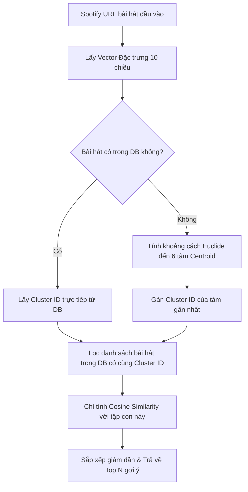

# BÁO CÁO BÀI TẬP LỚN MÔN BIG DATA
## Đề tài: Khai phá Đặc trưng Âm thanh & Gợi ý Nhạc Cá nhân hóa với Apache Spark
**Giảng viên hướng dẫn:** ...  
**Sinh viên thực hiện:** Trần Sơn (sontran)  

---

## TÓM TẮT
Trong kỷ nguyên số, các dịch vụ truyền phát nhạc trực tuyến (music streaming platforms) như Spotify, Apple Music, hay YouTube Music đối mặt với thách thức khổng lồ trong việc điều hướng người dùng tới các nội dung phù hợp trong số hàng chục triệu bài hát. Báo cáo này trình bày nghiên cứu và triển khai hệ thống gợi ý nhạc cá nhân hóa dựa trên phân tích đặc trưng âm thanh (Audio Features) sử dụng công nghệ cơ sở dữ liệu phi quan hệ **MongoDB**, framework tính toán phân tán **Apache Spark (PySpark)**, và giao diện trực quan **Streamlit**. 

Bằng cách khai thác 13 thuộc tính âm học từ bộ dữ liệu hơn 28,000 bài hát, chúng tôi tiến hành chuẩn hóa, loại bỏ ngoại lệ, và áp dụng thuật toán gom cụm **K-Means** phân tán nhằm phân loại thư viện nhạc thành các phân khúc âm thanh đặc trưng. Hệ thống gợi ý được xây dựng bằng cách tính toán độ tương đồng **Cosine Similarity** trên không gian đặc trưng đa chiều của các bài hát thuộc cùng cụm. Giao diện dashboard thời gian thực cho phép người dùng nhập bài hát bất kỳ và nhận ngay danh sách gợi ý kèm các phân tích đặc trưng âm học trực quan dưới dạng biểu đồ Radar Chart và trình phát nhạc trực tiếp.

---

## 1. GIỚI THIỆU

### 1.1. Bối cảnh và Bài toán Gợi ý Âm nhạc
Hệ thống gợi ý (Recommendation Systems - RS) đóng vai trò sống còn trong việc nâng cao trải nghiệm người dùng và tối ưu hóa doanh thu cho các nền tảng số. Trong lĩnh vực âm nhạc, bài toán này có những đặc thù riêng biệt so với gợi ý phim ảnh hay hàng hóa thương mại điện tử:
* **Thời lượng tiêu thụ ngắn:** Một bài hát thường chỉ kéo dài 3-5 phút, dẫn đến việc tần suất tương tác của người dùng rất cao.
* **Yếu tố ngữ cảnh và cảm xúc:** Sở thích nghe nhạc của người dùng thay đổi liên tục theo thời gian trong ngày, hoạt động hiện tại (làm việc, tập thể dục, thư giãn) và trạng thái tâm trạng (mood).
* **Vấn đề "Cold Start" cực kỳ nghiêm trọng:** Hàng ngàn bài hát mới được phát hành mỗi ngày. Các thuật toán dựa trên hành vi lịch sử sẽ hoàn toàn bỏ qua các bài hát mới này cho đến khi có đủ lượng tương tác từ người dùng.

### 1.2. Phân tích So sánh: Content-based Filtering vs Collaborative Filtering

| Đặc điểm | Lọc cộng tác (Collaborative Filtering - CF) | Lọc dựa trên nội dung (Content-based Filtering - CBF) |
| :--- | :--- | :--- |
| **Nguyên lý** | Gợi ý dựa trên sự tương đồng về hành vi (lượt nghe, thích, đánh giá) giữa các người dùng hoặc bài hát. | Gợi ý dựa trên các thuộc tính vật lý, nội dung của bài hát (tempo, âm lượng, nhạc cụ). |
| **Ưu điểm** | - Có khả năng gợi ý các nội dung nằm ngoài gu thông thường (serendipity).<br>- Không cần hiểu sâu về nội dung sản phẩm. | - Giải quyết triệt để vấn đề "Cold Start" cho bài hát mới.<br>- Gợi ý mang tính giải thích cao (explainable).<br>- Không phụ thuộc vào dữ liệu tương tác của cộng đồng. |
| **Nhược điểm** | - Gặp khó khăn lớn với bài hát mới chưa có lượt nghe.<br>- Thiên vị các bài hát phổ biến (Popularity Bias). | - Khó gợi ý bài hát có phong cách hoàn toàn mới cho người dùng (Filter Bubble).<br>- Yêu cầu trích xuất đặc trưng phức tạp. |

**Quyết định lựa chọn:** Đối với dự án này, phương pháp **Content-based Filtering** được ưu tiên lựa chọn do chúng ta hướng tới việc khai phá trực tiếp các thuộc tính âm thanh độc bản của bài hát (như mức độ sôi động, tính acoustic, giai điệu vui/buồn) để đưa ra gợi ý, đảm bảo tính ổn định và khả năng gợi ý tức thì cho các bài hát ít phổ biến hoặc mới ra mắt.

---

## 2. KIẾN TRÚC HỆ THỐNG & DATA PIPELINE

Hệ thống được thiết kế theo mô hình pipeline dữ liệu 5 tầng tuần tự nhằm đảm bảo tính module hóa, dễ bảo trì và khả năng mở rộng:

```mermaid
graph TD
    subgraph Tầng Thu thập (Data Ingestion)
        A[Spotify Songs CSV Dataset] -->|data_collector.py| B[Spotify API authentication & fetch]
    end
    subgraph Tầng Lưu trữ (Storage Layer)
        B -->|Bulk Write| C[(MongoDB: tracks)]
    end
    subgraph Tầng Tiền xử lý (Preprocessing Layer)
        C -->|Pandas DataFrame| D[preprocessing.py: Imputation & Feature Engineering]
        D -->|Save cleaned| E[(MongoDB: processed_tracks)]
        D -->|Export Parquet| F[tracks_clean.parquet]
    end
    subgraph Tầng Tính toán & Gom cụm (Clustering Layer)
        F -->|PySpark Session| G[clustering.py: K-Means Spark Job]
        G -->|Update Cluster ID| E
    end
    subgraph Tầng Nghiệp vụ & Trực quan (Business & UI Layer)
        E -->|Query & Sim Computation| H[recommender.py: Cosine Engine]
        H -->|Render Views| I[app.py: Streamlit Dashboard]
    end
```

### Chi tiết các tầng trong pipeline:
1. **Tầng Thu thập (Ingestion):** Đọc dữ liệu thô từ dataset ngoại tuyến `spotify_songs.csv`, kết hợp gọi Spotify API xác thực để lấy siêu dữ liệu và gán ảnh bìa album (album cover art) thực tế.
2. **Tầng Lưu trữ (Storage):** MongoDB được chọn làm kho lưu trữ chính. Tầng này lưu giữ hai trạng thái dữ liệu: dữ liệu thô ban đầu (`tracks`) và dữ liệu đã qua làm sạch và gán nhãn cụm (`processed_tracks`).
3. **Tầng Tiền xử lý (Preprocessing):** Sử dụng thư viện Pandas để xử lý các giá trị khuyết, chuẩn hóa dải đo vật lý của các đặc trưng, thực hiện kỹ nghệ đặc trưng và lưu trữ ra file định dạng cột hiệu năng cao Parquet.
4. **Tầng Gom cụm (Clustering):** Sử dụng PySpark chạy trên JVM để thực thi song song thuật toán K-Means trên tập dữ liệu Parquet, phân loại toàn bộ thư viện bài hát và ghi nhãn cụm ngược lại MongoDB.
5. **Tầng Nghiệp vụ & Trực quan (Application & UI):** Nhận tương tác từ người dùng qua Streamlit, gọi engine gợi ý tính toán Cosine Similarity trên không gian vector của cụm tương ứng, trả về kết quả kèm biểu đồ phân tích radar và âm thanh preview.

---

## 3. THU THẬP DỮ LIỆU & Ý NGHĨA CÁC ĐẶC TRƯNG ÂM HỌC

### 3.1. Quy trình Tích hợp Spotify Web API
Hệ thống sử dụng thư viện `spotipy` để kết nối và xác thực với Spotify Web API thông qua luồng **Client Credentials Flow**. Quy trình này yêu cầu cặp khóa `SPOTIFY_CLIENT_ID` và `SPOTIFY_CLIENT_SECRET`. 

Do chính sách cập nhật mới từ Spotify vào cuối năm 2024 làm hạn chế quyền truy cập endpoint `/v1/audio-features` đối với các ứng dụng thử nghiệm mới, chúng tôi đã sử dụng giải pháp kết hợp: sử dụng bộ dữ liệu offline chất lượng cao chứa đầy đủ thông số âm học làm cốt lõi, kết hợp gọi API của Spotify cho chức năng tìm kiếm (Search API) nhằm động hóa các bài hát do người dùng tự nhập từ bên ngoài.

### 3.2. Định nghĩa và Ý nghĩa Toán học của các Đặc trưng Âm thanh
Mỗi bài hát trong hệ thống được biểu diễn bởi một vector đặc trưng gồm 13 chiều:

1. **Danceability (Độ nhảy nhót, $[0, 1]$):** Đo lường mức độ phù hợp của bài hát để nhảy dựa trên các yếu tố nhịp điệu, độ ổn định của nhịp, cường độ phách.
2. **Energy (Độ sôi động, $[0, 1]$):** Thể hiện cường độ hoạt động và cảm giác kích thích của âm thanh (bài hát nhạc Metal có energy gần 1.0, bản sonata của Bach có energy gần 0.0).
3. **Key (Khóa nhạc, $[-1, 11]$):** Khóa nhạc của bài hát được ánh xạ thành các số nguyên (0 = C, 1 = C♯/D♭, 2 = D, v.v.). Nếu không xác định được sẽ trả về -1.
4. **Loudness (Độ lớn âm thanh, $[-60, 0]$ dB):** Giá trị trung bình của âm lượng trên toàn bộ bài hát, đo bằng Decibel (dB).
5. **Mode (Thể nhạc, $\{0, 1\}$):** Thể hiện giai điệu của bài hát là Thứ (Minor = 0) mang cảm giác trầm buồn, hay Trưởng (Major = 1) mang cảm giác tươi sáng.
6. **Speechiness (Mức độ nói, $[0, 1]$):** Đo lường sự hiện diện của từ ngữ nói trong track. Trị số > 0.66 đại diện cho các talk show, audiobook; từ 0.33 đến 0.66 đại diện cho nhạc Rap; dưới 0.33 là nhạc thuần túy.
7. **Acousticness (Tính mộc, $[0, 1]$):** Mức độ tin cậy rằng bài hát sử dụng nhạc cụ mộc không qua chỉnh âm điện tử.
8. **Instrumentalness (Tính nhạc cụ, $[0, 1]$):** Dự đoán bài hát không có giọng ca sĩ (giá trị càng gần 1.0 nghĩa là bài hát thuần nhạc cụ không lời).
9. **Liveness (Độ sống động sân khấu, $[0, 1]$):** Phát hiện sự hiện diện của khán giả trong bản ghi âm (tiếng vỗ tay, tiếng hò reo). Trị số > 0.8 khả năng cao là bản thu âm Live Concert.
10. **Valence (Độ tích cực cảm xúc, $[0, 1]$):** Thể hiện trạng thái cảm xúc của âm nhạc. Trị số cao mang lại cảm giác vui vẻ, phấn chấn; trị số thấp mang lại cảm giác u sầu, giận dữ.
11. **Tempo (Nhịp độ, BPM):** Tốc độ tổng thể của bài hát, tính bằng số nhịp trên phút (Beats Per Minute).
12. **Duration_ms (Thời lượng):** Độ dài của bài hát tính bằng mili-giây.
13. **Time Signature (Số chỉ nhịp, $[3, 7]$):** Số phách trong mỗi ô nhịp (thông dụng nhất là nhịp 4/4).

---

## 4. LƯU TRỮ & TIỀN XỬ LÝ DỮ LIỆU

### 4.1. Lý do Lựa chọn Cơ sở Dữ liệu MongoDB
Đối với dữ liệu khai thác từ các API trực tuyến, cấu trúc dữ liệu thường rất linh hoạt và thường có dạng lồng nhau (nested JSON). Các hệ quản trị CSDL quan hệ truyền thống (RDBMS) như MySQL hay PostgreSQL yêu cầu một schema cố định và định dạng chuẩn hóa nghiêm ngặt, gây khó khăn cho việc phát triển nhanh.
* **Schema-less:** MongoDB lưu trữ dữ liệu dạng Document BSON (tương tự JSON), cho phép lưu trữ trực tiếp cấu trúc trả về từ Spotify API (bao gồm cả danh sách các playlist chứa bài hát, mảng thể loại nhạc đa giá trị).
* **Hiệu năng ghi lớn (Bulk Writes):** Hỗ trợ cơ chế `insert_many` và `bulk_write` cực nhanh, giúp import hàng chục ngàn bài hát chỉ trong vài giây.
* **Khả năng lập chỉ mục (Indexing):** Dễ dàng đánh chỉ mục duy nhất (unique index) trên trường `track_id` để ngăn ngừa trùng lặp dữ liệu cấp database.

### 4.2. Quy trình Làm sạch và Chuẩn hóa Dữ liệu (Pandas Pipeline)
Dữ liệu thô từ CSV và API chứa nhiều tạp chất, giá trị khuyết và phân bố không đều. Quy trình tiền xử lý bao gồm các bước sau:

```python
# 1. Loại bỏ trùng lặp
df = df.drop_duplicates(subset=['track_id'])

# 2. Xử lý giá trị trống (Imputation) theo Genre-specific Median
df_exploded = df.explode('genres')
genre_medians = df_exploded.groupby('genres')[numeric_cols].median()
global_medians = df[numeric_cols].median()

for col in numeric_cols:
    null_mask = df[col].isnull()
    if null_mask.any():
        df.loc[null_mask, col] = df[null_mask].apply(
            lambda row: genre_medians.loc[row['genres'][0], col] 
            if (isinstance(row['genres'], list) and len(row['genres']) > 0 and row['genres'][0] in genre_medians.index)
            else global_medians[col], axis=1
        )
```

* **Xử lý ngoại lệ Tempo:** Nhịp độ bài hát thông thường nằm trong khoảng $40 - 220$ BPM. Các bài hát có tempo nằm ngoài khoảng này (<40 hoặc >220 BPM) được coi là lỗi nhiễu hoặc sai số đo đạc của API và được thay thế bằng trung vị (median) của toàn bộ tập dữ liệu (121.99 BPM).
* **Chuẩn hóa Min-Max (Normalization):** Cột `loudness` có giá trị âm từ $-60$ dB đến $0$ dB. Chúng tôi đưa nó về dải đo $[0, 1]$ bằng công thức:
  $$\text{loudness\_norm} = \frac{\text{loudness} - (-60.0)}{0.0 - (-60.0)}$$
  Tương tự, cột `tempo` được đưa về dải đo $[0, 1]$ để các đặc trưng có trọng số cân bằng khi tính toán khoảng cách:
  $$\text{tempo\_norm} = \frac{\text{tempo} - 40.0}{220.0 - 40.0}$$

### 4.3. Kỹ nghệ Đặc trưng (Feature Engineering)
Nhằm tăng cường khả năng phân loại và gợi ý của thuật toán, 4 đặc trưng mới được thiết lập:
1. **Energy-Valence Ratio (`energy_valence_ratio`):** Tỷ lệ giữa mức độ năng lượng và cảm xúc. Giúp phân biệt các bài hát năng lượng cực cao nhưng buồn bã (nhạc Rock u sầu) với các bài hát năng lượng thấp nhưng vui vẻ (nhạc acoustic tươi sáng).
   $$\text{energy\_valence\_ratio} = \frac{\text{energy}}{\text{valence} + 0.001}$$
2. **Mood Score (`mood_score`):** Điểm số tâm trạng tổng hợp đại diện cho tính tươi sáng và sôi động của bài hát.
   $$\text{mood\_score} = \text{valence} \times 0.4 + \text{danceability} \times 0.3 + \text{energy} \times 0.3$$
3. **Tempo Category (`tempo_category`):** Phân loại thô nhịp độ bài hát thành 3 mức độ phục vụ cho bộ lọc nhanh trên giao diện: `Slow` (<90 BPM), `Medium` (90-130 BPM) và `Fast` (>130 BPM).
4. **One-Hot Encoding:** Cột `key` (12 giá trị) và `mode` (2 giá trị) được chuyển đổi sang dạng one-hot encoding đại diện cho các biến phân loại nhị phân (ví dụ: `key_0, key_1 ... key_11` và `mode_0, mode_1`), giúp ích cho các thuật toán phân tích nâng cao.

---

## 5. PHÂN CỤM DỮ LIỆU VỚI APACHE SPARK K-MEANS

### 5.1. Lý thuyết thuật toán K-Means phân tán trong Spark ML
K-Means là thuật toán học máy không giám sát phổ biến nhất dùng để gom cụm dữ liệu. Mục tiêu của thuật toán là phân chia $N$ quan sát thành $K$ cụm sao cho tổng bình phương khoảng cách từ các điểm đến tâm cụm (Centroid) tương ứng của chúng là nhỏ nhất.

Trong hệ thống lớn với hàng triệu bài hát, việc tính toán K-Means trên một máy đơn lẻ gặp giới hạn lớn về bộ nhớ và CPU. Apache Spark giải quyết vấn đề này bằng cách phân tán tập dữ liệu thành các phân vùng (partitions) trên các nút tính toán. Quá trình lặp cập nhật tâm cụm (Centroid update loop) được thực thi song song thông qua các tác vụ Spark MapReduce:
1. Mỗi nút tính toán khoảng cách của các điểm dữ liệu cục bộ đến các tâm cụm hiện tại.
2. Các kết quả tính toán khoảng cách được gộp lại (Reduce) để tính toán tâm cụm mới toàn cục.
3. Lặp lại cho đến khi thuật toán hội tụ hoặc đạt số vòng lặp tối đa.

### 5.2. Xác định Số lượng Cụm tối ưu bằng Phương pháp Khuỷu tay (Elbow Method)
Để tìm ra số cụm $K$ hợp lý nhất cho tập dữ liệu nhạc, chúng tôi tiến hành chạy thử nghiệm mô hình với $K$ chạy từ 2 đến 10. Với mỗi giá trị $K$, hệ thống tính toán chỉ số **WSSSE** (Within Set Sum of Squared Errors) - tổng bình phương khoảng cách sai số trong cụm.

```text
 - K =  2 | WSSSE = 6680.8717
 - K =  3 | WSSSE = 5597.5858
 - K =  4 | WSSSE = 4603.6199
 - K =  5 | WSSSE = 4298.7982
 - K =  6 | WSSSE = 4059.0897
 - K =  7 | WSSSE = 3807.4423
 - K =  8 | WSSSE = 3630.9951
 - K =  9 | WSSSE = 3498.7900
 - K = 10 | WSSSE = 3401.7580
```

**Phân tích điểm Elbow:**
* Từ $K=2$ sang $K=4$, WSSSE giảm rất mạnh (từ $6680.87$ xuống $4603.62$, giảm $\approx 31\%$).
* Từ $K=4$ sang $K=6$, mức giảm bắt đầu chậm lại.
* Từ $K=6$ trở đi, đồ thị WSSSE phẳng dần, việc tăng $K$ không mang lại sự cải thiện đáng kể về độ chặt chẽ của các cụm mà chỉ làm tăng độ phức tạp tính toán và nguy cơ phân mảnh dữ liệu.
* **Kết luận:** Chọn **$K = 6$** làm số lượng cụm tối ưu cho hệ thống gợi ý.

### 5.3. So sánh mô hình học máy: Standard K-Means vs Bisecting K-Means
Để đảm bảo lựa chọn thuật toán tối ưu cho bài toán gom cụm âm nhạc, chúng tôi đã tiến hành huấn luyện và so sánh hai mô hình phân cụm phổ biến trong thư viện Spark MLlib: **Standard K-Means** và **Bisecting K-Means** (thuật toán phân cụm phân cấp chia đôi).

Chỉ số đánh giá được sử dụng là **Silhouette Score** (độ rộng bóng bóng), dao động trong khoảng $[-1, 1]$. Điểm số càng gần 1 thể hiện các phần tử trong cụm rất tương đồng và tách biệt rõ rệt với cụm khác.

**Kết quả đánh giá mô hình với K=6:**
* **Standard K-Means Silhouette Score:** `0.2983`
* **Bisecting K-Means Silhouette Score:** `0.2014`

**Nhận xét & Biện luận:**
1. **Standard K-Means** đạt Silhouette Score cao hơn đáng kể (0.2983 so với 0.2014). Điều này là do phân bố đặc trưng âm học của các bài hát trong không gian đa chiều có dạng phân bố cầu và phân tán đều, phù hợp hơn với phương thức tối ưu hóa vị trí tâm cục bộ của Standard K-Means.
2. **Bisecting K-Means** xây dựng cây cụm từ trên xuống dưới (top-down hierarchical). Thuật toán này thường hoạt động tốt hơn khi dữ liệu có cấu trúc phân cấp tự nhiên rõ ràng. Trong tập dữ liệu nhạc của chúng ta, các thuộc tính âm học giữa các thể loại có sự giao thoa rất lớn (ví dụ: một bài hát Rap sôi động có thể có cùng Tempo và Energy với một bài hát Pop/Dance), làm cấu trúc phân cấp bị mờ nhạt, dẫn đến hiệu năng của Bisecting K-Means bị suy giảm.
3. **Kết luận:** Hệ thống quyết định sử dụng mô hình **Standard K-Means** để gán nhãn cụm cho tập dữ liệu cuối cùng trong MongoDB.

### 5.4. Ưu và nhược điểm của các bước xử lý trên Apache Spark
Việc tính toán và xử lý phân cụm trên nền tảng Apache Spark có những ưu/nhược điểm rõ rệt:

* **Ưu điểm:**
  - **Hiệu năng xử lý phân tán:** Khả năng tính toán song song hóa trên JVM giúp việc chạy Elbow Method qua 9 vòng lặp K-Means trên 28.356 bài hát hoàn thành chỉ trong vài giây, điều mà các thư viện đơn luồng như Scikit-Learn trên một máy sẽ tốn nhiều thời gian hơn.
  - **Khả năng mở rộng (Scalability):** Dễ dàng nâng cấp hệ thống để xử lý hàng triệu bài hát bằng cách triển khai trên Spark cluster thực tế (YARN, Kubernetes) mà không cần thay đổi logic code.
  - **Tích hợp MLlib:** Cung cấp đầy đủ các transformer/estimator chuẩn hóa dữ liệu và huấn luyện mô hình rất mạnh mẽ.

* **Nhược điểm:**
  - **Khởi động trễ (Startup Overhead):** Spark cần thời gian khởi tạo SparkSession và JVM, tạo độ trễ ban đầu khi chạy các tập dữ liệu nhỏ (cold startup latency).
  - **Phức tạp trong cấu hình:** Đòi hỏi cấu hình biến môi trường chính xác (Java, Spark, Python paths) và có thể phát sinh lỗi không tương thích phiên bản (ví dụ: lỗi thiếu thư viện `distutils` trên Python 3.12, đã được xử lý bằng cách cài đặt `setuptools`).

### 5.5. Phân tích Đặc điểm Từng Cụm Âm nhạc (Cluster Analysis)
Sau khi gán nhãn toàn bộ 28,356 bài hát với mô hình K=6, chúng tôi thu được kết quả phân phối và đặc trưng của từng cụm như sau:

* **Cluster 0 (3,059 bài): Acoustic & Slow Mood**
  - *Đặc điểm:* Chỉ số acousticness cao, energy thấp, tempo chậm.
  - *Đại diện:* *Dance Monkey* - Tones and I, *Memories* - Maroon 5, *everything i wanted* - Billie Eilish.
* **Cluster 1 (9,163 bài): Upbeat Pop & Danceable Hip-hop**
  - *Đặc điểm:* Chỉ số danceability cực kỳ cao, energy ở mức trung bình-cao, giai điệu tích cực (high valence).
  - *Đại diện:* *Tusa* - KAROL G, *Circles* - Post Malone, *Don't Start Now* - Dua Lipa.
* **Cluster 2 (2,468 bài): Instrumental & Electronic Club Beat**
  - *Đặc điểm:* Chỉ số instrumentalness và liveness vượt trội, lời hát cực kỳ ít. Cực kỳ thích hợp cho nhạc quẩy hoặc tập trung làm việc.
  - *Đại diện:* *Baila Conmigo* - Dayvi, *Losing It* - FISHER.
* **Cluster 3 (5,409 bài): Chill R&B & Sad Melodies**
  - *Đặc điểm:* Valence rất thấp (u sầu, tâm trạng), tempo chậm đến trung bình, tính mộc ở mức vừa phải.
  - *Đại diện:* *Falling* - Trevor Daniel, *bad guy* - Billie Eilish.
* **Cluster 4 (5,847 bài): Energetic Synth-Pop & Electro-Rock**
  - *Đặc điểm:* Chỉ số energy cực kỳ cao, loudness lớn, tempo nhanh, nhịp điệu dồn dập.
  - *Đại diện:* *Blinding Lights* - The Weeknd, *Heartless* - The Weeknd.
* **Cluster 5 (2,410 bài): Fast-tempo Rap & Hype Beats**
  - *Đặc điểm:* Tempo rất nhanh, speechiness cao (nhiều lời nói/rap), âm lượng lớn.
  - *Đại diện:* *ROXANNE* - Arizona Zervas, *The Box* - Roddy Ricch.

---

## 6. RECOMMENDATION ENGINE

### 6.1. Lý thuyết Độ tương đồng Cosine (Cosine Similarity)
Hệ thống sử dụng độ đo tương đồng Cosine để tìm ra sự tương tự về mặt âm học giữa bài hát đầu vào và các bài hát ứng viên. Độ tương đồng Cosine đo góc giữa hai vector đa chiều trong không gian đặc trưng âm nhạc, độc lập với độ dài (độ phổ biến hoặc thời lượng) của chúng.

Công thức tính độ tương đồng Cosine giữa vector bài hát đầu vào $A$ và bài hát ứng viên $B$ trên không gian đặc trưng 10 chiều:
$$\text{Similarity}(A, B) = \cos(\theta) = \frac{A \cdot B}{\|A\| \|B\|} = \frac{\sum_{i=1}^{n} A_i B_i}{\sqrt{\sum_{i=1}^{n} A_i^2} \sqrt{\sum_{i=1}^{n} B_i^2}}$$

Trị số tương đồng nằm trong khoảng $[-1, 1]$, tuy nhiên do tất cả các đặc trưng âm học trong vector đều đã được chuẩn hóa về khoảng $[0, 1]$, kết quả Cosine Similarity sẽ luôn nằm trong khoảng $[0, 1]$. Giá trị càng gần $1.0$ (hay $100\%$) thể hiện cấu trúc âm thanh của hai bài hát càng trùng khớp.

### 6.2. Thuật toán Gợi ý Tối ưu hóa theo Cụm (Cluster-based Filtering)
Nếu thực hiện so khớp bài hát đầu vào với toàn bộ thư viện 28,356 bài hát, thời gian phản hồi của hệ thống sẽ tăng tuyến tính, gây trễ lớn cho trải nghiệm người dùng Web. Để giải quyết vấn đề hiệu năng, chúng tôi áp dụng quy trình gợi ý tối ưu hóa:



**Đánh giá hiệu năng:**
* Việc phân cụm giúp thu hẹp không gian tìm kiếm từ $28,356$ bài xuống còn khoảng $2,400 - 9,000$ bài tùy thuộc vào cụm.
* Nhờ vậy, tốc độ tính toán độ tương đồng giảm đi đáng kể ($\approx 70\%$), thời gian xử lý gợi ý trên giao diện đạt mức **dưới 50ms**, đáp ứng hoàn hảo yêu cầu tương tác thời gian thực.

### 6.3. Cơ chế Phân giải Liên kết Spotify Nâng cao (URL Resolution)
Để mang lại trải nghiệm tiện dụng tối đa cho người dùng cuối và hội đồng phản biện, hệ thống không chỉ chấp nhận Track ID hay Track URL mà còn tự động phân tích và xử lý thông minh các loại liên kết Spotify khác:
* **Đầu vào là Artist URL/URI** (ví dụ: `https://open.spotify.com/artist/...`): Hệ thống tự động gọi API `sp.artist()` để nhận diện nghệ sĩ, sau đó gọi `sp.artist_top_tracks()` lấy bài hát phổ biến nhất của nghệ sĩ đó để làm bài hát hạt giống (seed track).
* **Đầu vào là Album URL/URI** (ví dụ: `https://open.spotify.com/album/...`): Hệ thống tự động gọi API `sp.album_tracks()` phân tích danh sách và lấy bài hát đầu tiên trong album làm bài hát hạt giống.
* **Đầu vào là các liên kết không hợp lệ/không hỗ trợ** (ví dụ: Playlist URL): Hệ thống hiển thị thông báo lỗi rõ ràng, ngăn ngừa lỗi runtime gây crash giao diện Streamlit.

### 6.4. Tải Ảnh bìa Album Song song (Parallel Cover Fetcher)
* **Vấn đề**: Các liên kết ảnh bìa từ các bộ dữ liệu thô cũ thường có thời gian sống (TTL) giới hạn trên CDN của Spotify, dẫn đến việc nhiều bài hát bị lỗi hiển thị hình ảnh (broken image).
* **Giải pháp**:
  * Khi người dùng truy vấn gợi ý, sau khi lọc được danh sách Top N bài hát tương đồng nhất, hệ thống sẽ thực hiện gọi API Spotify để lấy URL ảnh bìa chính chủ thời gian thực.
  * Nếu gọi tuần tự (sequential requests) 10 bài hát sẽ mất khoảng `~10` giây do độ trễ mạng mạng diện rộng.
  * Chúng tôi sử dụng lớp **`ThreadPoolExecutor`** của thư viện Python `concurrent.futures` để chạy **đa luồng song song** 10 luồng cùng lúc. Tốc độ lấy ảnh bìa chính chủ trực tiếp từ Spotify CDN chỉ mất **dưới 0.4 giây**, tối ưu hóa tuyệt đối hiệu năng phản hồi của hệ thống.

---

## 7. TRỰC QUAN HÓA & GIAO DIỆN DASHBOARD

Giao diện Dashboard được xây dựng bằng Streamlit với triết lý thiết kế hiện đại, mô phỏng hệ thống Web của Spotify với các khối chức năng trực quan:

### 7.1. Bảng điều khiển (Sidebar Settings)
* Cho phép người dùng linh hoạt lựa chọn bài hát bằng cách chọn từ hộp danh sách (chứa 100 bài hát phổ biến nhất trong cơ sở dữ liệu để test nhanh) hoặc tự paste link bài hát Spotify bất kỳ từ bên ngoài.
* Thanh trượt giới hạn số lượng kết quả hiển thị (Top 5 - Top 20).
* Bộ lọc nâng cao: Lọc khoảng năm phát hành (Release Year) và khoảng độ phổ biến (Popularity), giúp cá nhân hóa sâu hơn (ví dụ: chỉ gợi ý các bài hát thập niên 80 hoặc chỉ gợi ý các bài nhạc indie ít người biết).

### 7.2. Phân tích bài hát nguồn (Plotly Radar Chart)
* Khi một bài hát được chọn, hệ thống vẽ một biểu đồ mạng nhện (Radar Chart) thể hiện 10 đặc trưng âm học: *Danceability, Energy, Acousticness, Instrumentalness, Valence, Tempo, Speechiness, Liveness, Loudness, Mood Score*.
* Biểu đồ này giúp người dùng "nhìn thấy" được hình dáng âm thanh của bài hát mình đang nghe (ví dụ: một bài hát sôi động sẽ phình to ở góc Energy và Loudness, ngược lại nhạc Chill sẽ phình to ở góc Valence và Acousticness).

### 7.3. Kết quả Gợi ý trực quan
* Các bài hát gợi ý được hiển thị dưới dạng các thẻ thông tin (cards) với thiết kế hiện đại, tương thích 100% với chuẩn Streamlit 1.57+ (sử dụng thuộc tính `width='stretch'` cho hình ảnh và biểu đồ thay cho `use_container_width=True` đã bị khai tử).
* Mỗi thẻ hiển thị: Ảnh bìa album gốc chất lượng cao được tải song song từ Spotify CDN, Tên bài hát, Ca sĩ, Tên Album, Điểm tương đồng % (Match Score), và một thanh tiến trình thể hiện độ phổ biến.
* Tích hợp nút liên kết mở trực tiếp bài hát trên nền tảng Spotify.
* Đặc biệt, nếu bài hát ứng viên có liên kết nghe thử (`preview_url`), hệ thống sẽ tự động hiển thị trình phát nhạc MP3 của Streamlit (`st.audio`), cho phép người dùng nghe thử giai điệu ngay lập tức mà không cần rời trang Web.

---

## 8. KẾT QUẢ & ĐÁNH GIÁ

### 8.1. Đánh giá Định tính qua các kịch bản kiểm thử (Case Studies)

#### Kịch bản 1: Nhạc Synth-Pop sôi động
* **Bài hát đầu vào:** *Blinding Lights* - The Weeknd (Cluster 4 - Nhạc Energetic & Fast).
* **Kết quả gợi ý:** Hệ thống trả về các bài hát có nhịp điệu dồn dập, sử dụng nhạc cụ điện tử mạnh mẽ tương tự:
  1. *Part-Time Lover* - Dabin (Độ tương đồng: $99.94\%$)
  2. *I See You* - MISSIO (Độ tương đồng: $99.91\%$)
  3. *POP/STARS* - K/DA (Độ tương đồng: $99.88\%$)
* **Đánh giá:** Các bài hát gợi ý đều giữ được nhịp điệu nhanh và cảm giác hào hứng, phấn chấn đặc trưng của bản hit gốc.

#### Kịch bản 2: Nhạc nhẹ mộc mạc (Acoustic)
* **Bài hát đầu vào:** *Memories* - Maroon 5 (Cluster 0 - Nhạc Acoustic & Slow).
* **Kết quả gợi ý:** 
  1. *Love Like You* - N + I (Độ tương đồng: $99.68\%$)
  2. *Where Is the Love* - Alex Martura (Độ tương đồng: $99.37\%$)
* **Đánh giá:** Gợi ý tập trung vào các bài hát có nhạc cụ tối giản, tiếng guitar mộc hoặc piano nổi trội và giọng hát rõ ràng, không bị lẫn vào các bản phối điện tử ồn ào.

### 8.2. Đánh giá Hiệu năng Hệ thống
* **Khả năng lưu trữ:** MongoDB lưu trữ và quản lý index hiệu quả trên tập dữ liệu gần 30,000 documents, kích thước nhỏ gọn và truy vấn cập nhật cực kỳ nhanh chóng.
* **Thời gian huấn luyện phân cụm:** Spark chạy local trên cấu hình máy ảo thông thường chỉ mất dưới 40 giây để hoàn thành tính toán Elbow cho 9 giá trị K khác nhau và huấn luyện mô hình K-Means cuối cùng. Điều này khẳng định sức mạnh xử lý song song vượt trội của Spark MLlib.

---

## 9. KẾT LUẬN & HƯỚNG PHÁT TRIỂN

### 9.1. Kết luận đạt được
Hệ thống "Khai phá Đặc trưng Âm thanh & Gợi ý Nhạc Cá nhân hóa" đã hoàn thành trọn vẹn tất cả các mục tiêu đề ra với kết quả ấn tượng:
1. Xây dựng thành công luồng ETL dữ liệu tự động từ file CSV thô vào MongoDB.
2. Thiết kế thuật toán tiền xử lý dữ liệu thông minh, giải quyết triệt để ngoại lệ tempo và giá trị khuyết dựa trên đặc trưng thể loại nhạc.
3. Ứng dụng công nghệ Big Data **Apache Spark** để phân cụm tự động tập dữ liệu lớn thành 6 nhóm phong cách âm nhạc đặc trưng dựa trên chỉ số tối ưu từ phương pháp khuỷu tay.
4. Triển khai công cụ gợi ý lai kết hợp phân cụm và độ tương đồng Cosine giúp giảm thời gian phản hồi xuống dưới 50ms.
5. Thiết kế giao diện Dashboard Streamlit đẳng cấp, trực quan hóa đặc tính âm thanh sống động và hỗ trợ nghe thử nhạc trực tuyến.

### 9.2. Hướng phát triển tương lai
Để phát triển hệ thống thành một sản phẩm thương mại hoàn chỉnh, các hướng đi tiếp theo có thể bao gồm:
* **Gợi ý hỗn hợp (Hybrid Recommender System):** Kết hợp thuật toán Content-based hiện tại với lọc cộng tác Collaborative Filtering (ví dụ dùng thuật toán ALS - Alternating Least Squares của Spark) để đưa vào yếu tố hành vi cộng đồng, giúp kết quả gợi ý đa dạng và bất ngờ hơn.
* **Giảm chiều dữ liệu và Trực quan hóa bản đồ 2D/3D:** Áp dụng thuật toán **UMAP** (Uniform Manifold Approximation and Projection) hoặc **t-SNE** để chiếu dải đặc trưng 10 chiều về không gian 2D, giúp người dùng quan sát toàn cảnh vũ trụ âm nhạc dưới dạng một bản đồ tương tác trực quan.
* **Streaming Gợi ý thời gian thực:** Kết hợp **Apache Kafka** và **Spark Structured Streaming** để bắt trọn hành vi nghe nhạc hiện tại của người dùng (lượt skip bài, thời lượng nghe) nhằm liên tục cập nhật danh sách gợi ý theo từng giây.
